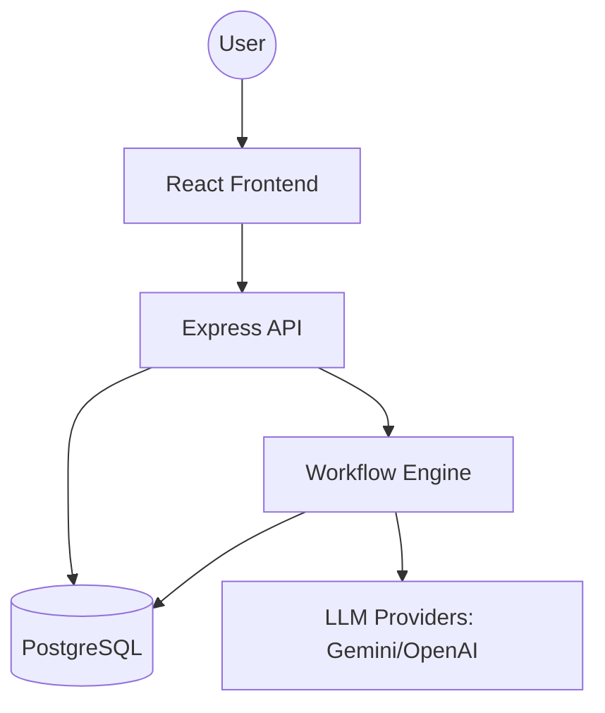

# Nexus AI Ops

Nexus AI Ops centralizes fragmented business processes into a single, AI-integrated dashboard. By combining job tracking, CRM, and lead management with native workflow automation, it eliminates tool sprawl and uses AI to proactively manage tasks and client relationships.

## 🚀 Value Proposition

- **Centralized Operations**: Stop jumping between tools. Manage leads, jobs, and workflows in one place.
- **AI-Native Intelligence**: Proactive lead scoring, enrichment, and task management powered by Google Gemini.
- **Custom Automation**: A flexible, TypeScript-based workflow engine to automate your unique business processes.
- **Proactive Insights**: Get AI-generated summaries and priority alerts to stay ahead of your pipeline.

## 🏗️ Architecture



## 🛠️ Tech Stack

- **Frontend**: React, TypeScript, Vite, Tailwind CSS, Lucide Icons.
- **Backend**: Node.js, Express, TypeScript.
- **ORM**: Prisma.
- **Database**: PostgreSQL (Production), SQLite (Development).
- **AI**: Google Gemini 1.5 Flash (Primary), support for modular LLM providers.
- **Monorepo**: NPM Workspaces.

## 📂 Project Structure

- `apps/web`: The React dashboard frontend.
- `apps/api`: Backend services and RESTful API.
- `packages/db`: Prisma schema, migrations, and shared database client.
- `packages/workflow`: Core automation engine and AI action handlers.

## ⚡ Quick Start

1. **Clone and Install**:
   ```bash
   git clone <repo-url>
   cd nexus-ai-ops
   npm install
   ```

2. **Environment Setup**:
   Create `.env` files in `apps/api` and `apps/web`.
   ```bash
   # apps/api/.env
   DATABASE_URL="postgresql://..."
   GEMINI_API_KEY="your-key"
   
   # apps/web/.env
   VITE_API_URL="http://localhost:3001"
   ```

3. **Initialize Database**:
   ```bash
   cd packages/db
   npx prisma generate
   npx prisma db push
   npx tsx prisma/seed.ts
   ```

4. **Run Development Servers**:
   ```bash
   # From root
   npm run dev --workspace=@nexus/api
   npm run dev --workspace=@nexus/web
   ```

## 📂 Documentation

- [API Reference](./API.md)
- [Deployment Guide](./DEPLOY.md)
- [Workflow Engine](./WORKFLOW_ENGINE.md)
- [UI Design System](./UI_DESIGN.md)

## 📄 License
MIT
